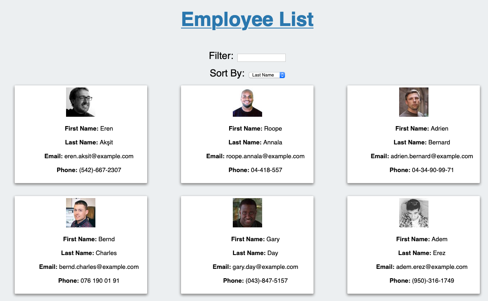

# Employee Directory
# Description
A searchable list of employees, sortable by first or last name.

# Table of Contents
1. [Installation](#installation)
2. [Usage](#usage)
3. [License](#license)
4. [Contributing](#contributing)
5. [Tests](#tests)
6. [Questions](#questions)
# Installation
npm i
# Usage
npm start
# License
MIT License
# Contributing
Open a pull request!
# Tests
npm run test
# Questions
Feel free to post an issue on my GitHub profile: @[mbesemann](https://github.com/mbesemann)
or contact me via email at mattiasb@hey.com
  